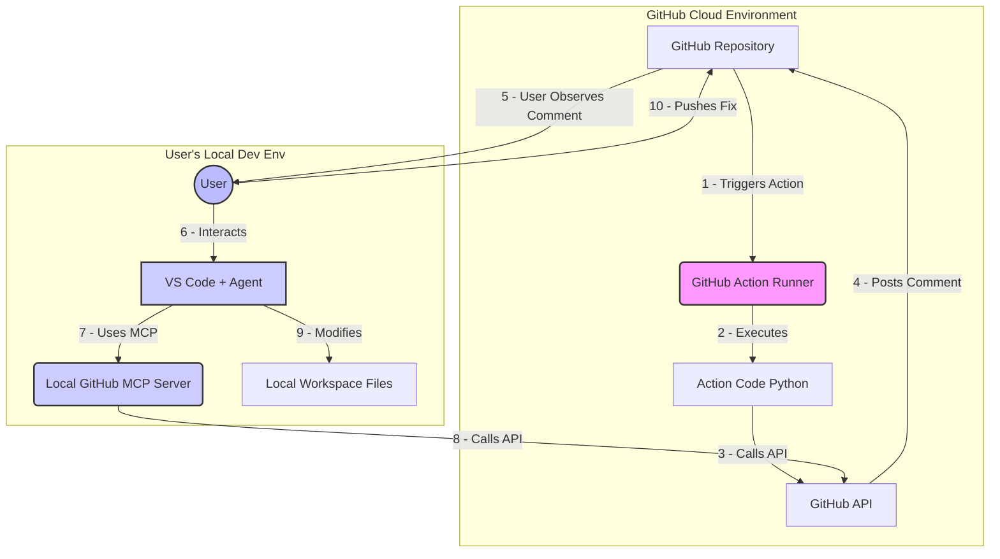

**Explanation:**

This diagram shows the two main environments involved:

1.  **GitHub Cloud:** Where the `pr-intent-checker` GitHub Action runs automatically (Steps 1-4). It executes the Python code, calls the GitHub API directly, and posts its results (e.g., a FAIL comment) back to the repository.
2.  **User's Local Environment:** Where the developer works (Steps 5-10). The User observes the comment posted by the Action (Step 5). If a fix is needed, the User interacts with their local tools (VS Code + Agent). The Agent uses the local GitHub MCP Server (which also calls the GitHub API) to get information (like the comment details) and modifies the local code files. Finally, the User pushes the corrected code back to GitHub.

The key takeaway is the separation: the Action runs independently in the cloud, while the MCP server assists the developer locally during the manual fixing process initiated by the User.
